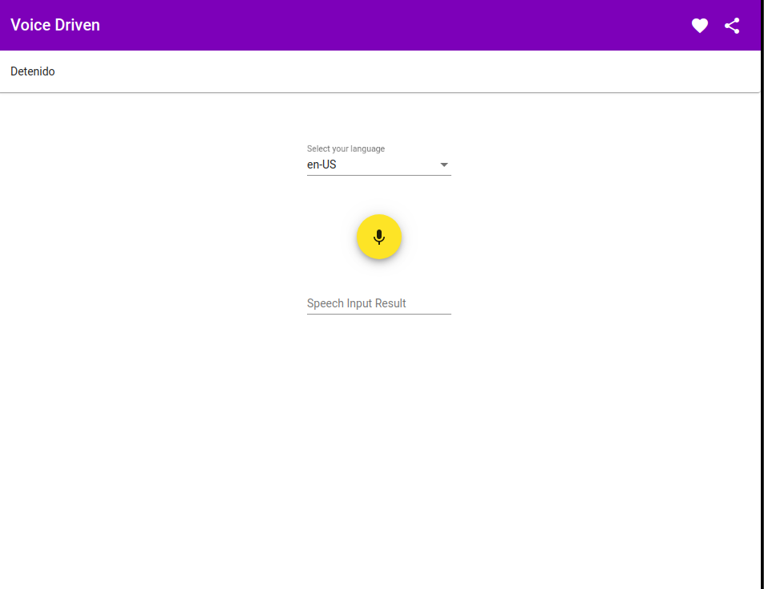

# VoiceDrive

Aplicacion impulsada por voz. Realizada con el tutorial de [luixaviles](https://github.com/luixaviles)

Este proyecto fue creado con [Angular CLI](https://github.com/angular/angular-cli) version 10.1.7 y la [API Web Speech](https://developer.mozilla.org/es/docs/Web/API/Web_Speech_API/Uso_de_la_Web_Speech_API)

[Demo del Proyecto](https://oriananohemi.github.io/voice-driven/)

## Instrucciones

Presione el microfono para que la aplicacion digite lo que usted le dicta, cuando ya no desee seguir hablando vuelva a presionar el microfono.

**Para cambiar el tema**
      1- Presione el microfono y diga *"Iniciar cambio de tema"*
      2- Presione de nuevo el microfono y diga alguna de las siguientes opciones: *"azul", "rosa", "purpura", "verde"*
      3- Para finalizar el cambio: *"Finalizar cambio de tema"*

**Recuerde que al finalizar una instruccion debe presionar el microfono para que la aplicacion deje de grabar**
## Scripts
### Para ejecutar el proyecto

Clone el repositorio

Instale las dependencias con el comando "npm install"

Puedes ejecutar el comando "ng serve"

Se abrira una pestaña en el browser http://localhost:4200/